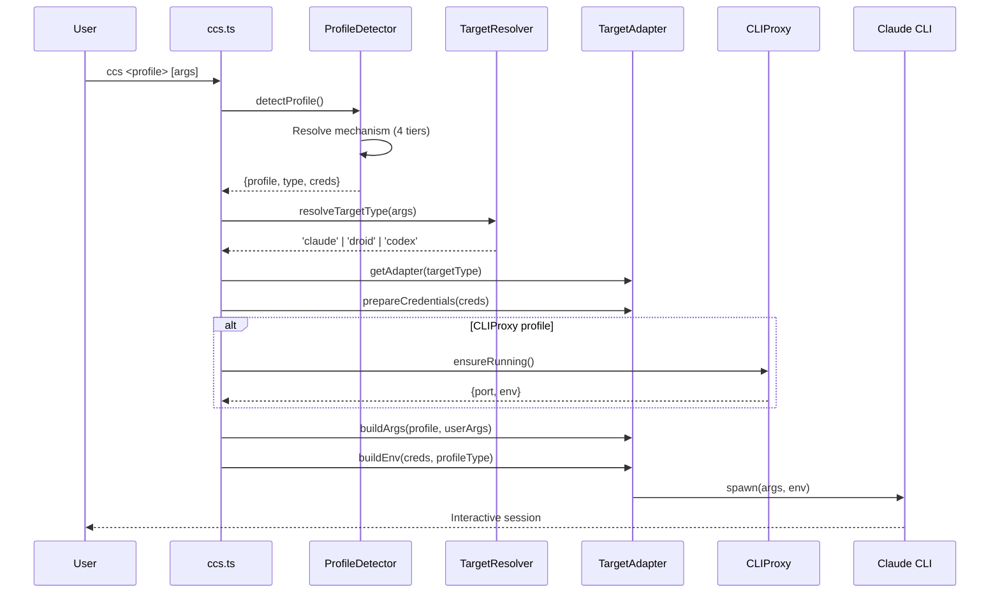
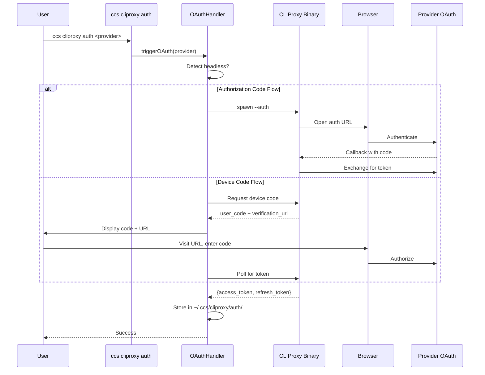

# CCS Architecture Reference

## System Diagram

```
+------------------+     +------------------+     +------------------+
|   User Input     |     |   Dashboard UI   |     |   CLI Commands   |
|   ccs <profile>  |     |   (React/Vite)   |     |   (~40 commands) |
+--------+---------+     +--------+---------+     +--------+---------+
         |                        |                        |
         v                        v                        v
+---------------------------------------------------------------+
|                      CCS Core (src/ccs.ts)                     |
|  - Profile detection    - Target resolution    - CLI routing   |
+---------------------------------------------------------------+
         |
    +----+----+
    |         |
    v         v
+--------+  +---------------------------------------------------+
| Target |  | CLIProxy System                                  |
|Adapter |  |  - OAuth auth    - Variant config    - Quota     |
| Layer  |  |  - Model catalog - Routing strategy  - Sync     |
+--------+  +---------------------------------------------------+
    |                      |
    v                      v
+--------+  +-------------------------------------------+
| Claude |  | CLIProxyAPI Binary (Go)                   |
| Droid  |  |  - /api/provider/<name>                   |
| Codex  |  |  - /v1/messages (composite)               |
+--------+  +-------------------------------------------+
                |
        +-------+-------+
        |               |
        v               v
+--------------+  +------------------+
|  Providers   |  | OpenAI-Compat    |
|  (OAuth/API) |  | Proxy (optional) |
+--------------+  +------------------+
```

## Layered Architecture

```
Presentation Layer
├── CLI (src/ccs.ts, src/commands/)
├── Dashboard (ui/src/, src/web-server/)
└── API (src/web-server/routes/)

Business Logic Layer
├── Profile Management (src/auth/, src/api/)
├── Proxy Orchestration (src/cliproxy/)
├── Target Adapters (src/targets/)
└── Config Management (src/config/)

Configuration Layer
├── Unified Config (src/config/unified-config-loader.ts)
├── Schemas (src/config/schemas/)
└── Migration (src/config/migration-manager.ts)

Infrastructure Layer
├── File System (src/utils/config-manager.ts)
├── Process Spawning (src/utils/process-utils.ts)
├── Network Proxy (src/proxy/, src/cliproxy/proxy/)
└── Logging (src/services/logging/)
```

## Data Flow: Profile Execution



## Data Flow: OAuth Authentication



## Module Dependencies

```
src/ccs.ts
├── src/auth/profile-detector.ts
├── src/targets/target-resolver.ts
├── src/targets/target-registry.ts
├── src/commands/root-command-router.ts
└── src/cliproxy/executor/index.ts

src/web-server/index.ts
├── src/web-server/routes/index.ts
├── src/web-server/middleware/auth-middleware.ts
├── src/web-server/websocket.ts
└── src/cliproxy/sync/auto-sync-watcher.ts

src/cliproxy/executor/index.ts
├── src/cliproxy/service-manager.ts
├── src/cliproxy/config/generator.ts
├── src/cliproxy/binary-manager.ts
├── src/cliproxy/auth/auth-handler.ts
└── src/cliproxy/accounts/account-manager.ts

src/config/unified-config-loader.ts
├── src/config/schemas/unified-config.ts
├── src/config/migration-manager.ts
└── src/utils/config-manager.ts
```
